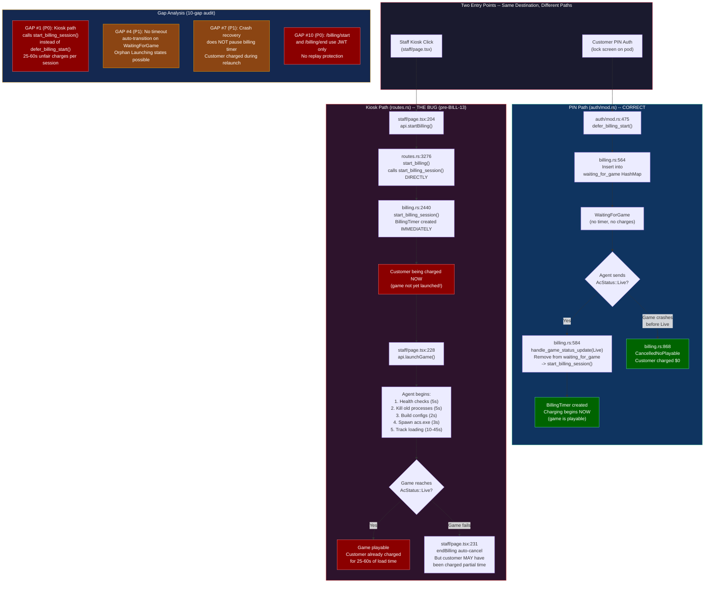
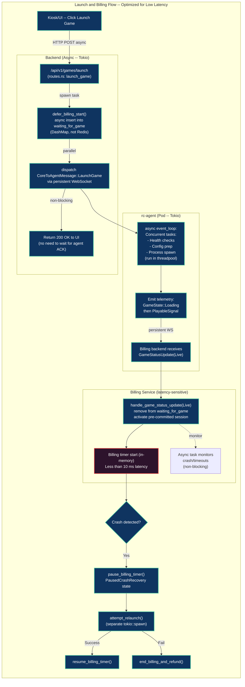

# Billing & Launch System Design — Complete Reference

> Created: 2026-04-01 | Status: Phase 280 SHIPPED, Phases 281-285 in progress
> Commits: 0d7570ae (BILL-13 deferred billing), 0a0f2414 (PausedCrashRecovery)

---

## 1. System Pseudocode (Claude-Friendly)

```
GOAL:
- Launch games asynchronously (no blocking in UI or backend)
- Start billing only when the game is playable
- Handle crashes / restarts correctly and quickly

PROCESS FLOW:

1. UI Layer
   - Event: User clicks "Launch Game"
   - Action: Send HTTP POST -> /api/v1/billing/start (async)
     -> Wallet debit + DB record created atomically (FATM-01)
     -> DB status = 'waiting_for_game' (NOT 'active')
     -> Entry inserted into waiting_for_game DashMap with pre_committed session data
   - Action: Send HTTP POST -> /api/v1/games/launch (async)
   - Expectation: UI receives immediate acknowledgement (200 OK)
   - UI shows: "Game Loading..." with elapsed timer (no billing counter yet)

2. Backend (Async Service — Tokio runtime)
   - Function: launch_game(request)
   - Steps:
       a. Validate pod_id, sim_type, launch_args
       b. Feature flag check (game_launch enabled)
       c. Billing gate: verify waiting_for_game OR active_timers entry exists
       d. Double-launch guard (LIFE-04): reject if game already Launching/Running
       e. Send CoreToAgentMessage::LaunchGame via persistent WebSocket
       f. Return 200 OK (non-blocking, no agent wait)

3. Agent Pod (rc-agent — Tokio runtime)
   - Asynchronous event loop (event_loop.rs) handles:
       - Acquire game_launch_mutex (SEC-10)
       - Clean state reset if force_clean (kill orphans)
       - Pre-launch health checks (MAINTENANCE_MODE, disk, exe path)
       - Kill existing game processes + dialog cleanup
       - Parse launch_args JSON -> per-game config
       - Build config files (race.ini, assists.ini, gui.ini)
       - Spawn game executable (acs.exe / f1game.exe)
   - When process detected:
       - Emit GameState::Loading via AgentMessage::GameStateUpdate
   - Per-sim PlayableSignal detection:
       - AC: AcStatus::Live from shared memory (acpmf_physics)
       - F1 25: First UDP packet on port 20777
       - iRacing: IsOnTrack from rF2 shared memory
       - Other sims: 90s process-based fallback
   - When playable:
       - Send AgentMessage::GameStatusUpdate { ac_status: AcStatus::Live }

4. Billing Service (billing.rs — latency-sensitive)
   - On receive(GameStatusUpdate(Live)):
       - Remove entry from waiting_for_game DashMap
       - If pre_committed (kiosk path):
           - UPDATE billing_sessions SET started_at = NOW, status = 'active'
           - finalize_billing_start() -> create in-memory BillingTimer (<10ms)
       - If not pre_committed (PIN auth path):
           - start_billing_session() -> INSERT + create timer
       - Launch async monitor task (non-blocking)
   - On timeout (check_launch_timeouts, every 5s):
       - If waiting > 180s (configurable):
           - If pre_committed: UPDATE status='cancelled_no_playable', refund wallet
           - If not: INSERT cancelled_no_playable record
       - Customer charged $0

5. Crash / Resume Logic (Phase 281 — PausedCrashRecovery)
   - If crash detected (AcStatus::Off while billing Active):
       - FSM transition: Active -> PausedCrashRecovery (via BillingEvent::CrashPause)
       - Billing timer paused, recovery_pause_seconds incrementing
       - Auto-relaunch attempted (max 2-3 attempts)
       - If relaunch success (AcStatus::Live again):
           - FSM transition: PausedCrashRecovery -> Active (via BillingEvent::Resume)
           - Customer NOT charged for recovery window
       - If max retries exceeded:
           - End billing, refund recovery window duration
           - WhatsApp alert to staff

LATENCY TARGETS:
- /billing/start response: < 100ms (DB tx + wallet debit)
- /games/launch response: < 50ms (validation + WS dispatch)
- Billing start after Live signal: < 10ms (in-memory timer creation)
- Crash pause/resume: < 20ms (local DashMap atomic update)
- Nonce check (Phase 283): < 5ms (in-memory DashMap with TTL sweep)
```

---

## 2. Architecture Flowchart — Two Entry Paths (Before Fix)

This diagram shows the bug that existed before BILL-13 (commit 0d7570ae):



---

## 3. Fixed Flow — BILL-13 Unified Deferred Billing

After commit 0d7570ae, both paths now use deferred billing:

```mermaid
flowchart TD
    subgraph FIXED["FIXED: Unified Deferred Billing (v33.0 Phase 280)"]
        direction TB

        A["Staff clicks Launch Game\n(staff/page.tsx)"] --> B["POST /api/v1/billing/start\n{pod_id, driver_id, pricing_tier_id}"]

        B --> C["routes.rs: start_billing()\n1. Validate inputs (waiver, minor, trial)\n2. Compute pricing (dynamic, coupons, group)\n3. Atomic TX: wallet debit + DB INSERT\n4. Status = 'waiting_for_game'"]

        C --> D["billing.rs: defer_billing_with_precommitted_session()\nInsert into waiting_for_game DashMap\nwith pre_committed = Some(BillingStartData)\nNO in-memory timer yet. $0 charged."]

        D --> E["POST /api/v1/games/launch\nSend CoreToAgentMessage::LaunchGame\nvia WebSocket to pod"]

        E --> F["rc-agent event_loop.rs:\n1. Health checks\n2. Kill old processes\n3. Build configs\n4. Spawn acs.exe"]

        F --> G["Agent emits:\nGameState::Loading\n(process alive, not playable)"]

        G --> H["Kiosk shows:\n'Game Loading...' with elapsed timer\nStill $0 charged to timer"]

        H --> I{"Per-sim PlayableSignal\n(already implemented!)"}

        I -- "AC: AcStatus::Live\n(shared memory)" --> J["Agent sends\nGameStatusUpdate\n{ac_status: Live}"]
        I -- "F1 25: UDP on 20777\n(first telemetry)" --> J
        I -- "iRacing: IsOnTrack\n(shared memory)" --> J
        I -- "Other: 90s process\nfallback" --> J

        J --> K["billing.rs: handle_game_status_update(Live)\nBILL-13 pre-committed branch:\n1. UPDATE started_at = NOW, status = 'active'\n2. Log billing_timer_started event\n3. finalize_billing_start() -> in-memory timer"]

        K --> L["BillingTimer created NOW\nGame is playable -- fair billing\nKiosk: 'Running -- Billing Active'"]
    end

    subgraph TIMEOUT["Timeout Path"]
        D --> T1{"PlayableSignal\nwithin timeout?\n(AC=180s, others=90s)"}
        T1 -- "Timeout exceeded" --> T2["check_launch_timeouts()\nUPDATE status='cancelled_no_playable'\nRefund wallet debit\nCustomer charged $0"]
        T2 --> T3["Kiosk shows:\n'Launch Failed'\nNo billing created"]
    end

    subgraph CRASH_RECOVERY["Crash Recovery (Phase 281 -- PausedCrashRecovery)"]
        L --> CR1{"Game crashes\nduring session?"}
        CR1 -- Yes --> CR2["FSM: Active -> PausedCrashRecovery\nBilling timer PAUSED\nrecovery_pause_seconds counting"]
        CR2 --> CR3["Auto-relaunch\n(max 2-3 attempts)"]
        CR3 --> CR4{"Relaunch\nsucceeds?"}
        CR4 -- "AcStatus::Live\nagain" --> CR5["FSM: PausedCrashRecovery -> Active\nResume billing timer\n(crash window NOT charged)"]
        CR4 -- "Max retries\nexceeded" --> CR6["End billing\nRefund recovery window\nWhatsApp alert to staff"]
    end

    style FIXED fill:#0f3460,stroke:#4ecca3,color:#fff
    style TIMEOUT fill:#142850,stroke:#f6b93b,color:#fff
    style CRASH_RECOVERY fill:#1a1a2e,stroke:#3282b8,color:#fff
    style L fill:#006400,stroke:#4ecca3,color:#fff
    style T2 fill:#006400,stroke:#4ecca3,color:#fff
    style CR5 fill:#006400,stroke:#4ecca3,color:#fff
    style CR6 fill:#006400,stroke:#4ecca3,color:#fff
    style D fill:#006400,stroke:#4ecca3,color:#fff
    style H fill:#006400,stroke:#4ecca3,color:#fff
```



---

## 4. Optimized Latency-Aware Flow



---

## 5. Spec vs. Reality Mapping

| Spec Proposes | What Already Exists | What Was Built (Phase 280) | Remaining (281-285) |
|---|---|---|---|
| Redis for `waiting_for_game` | `DashMap<String, WaitingForGameEntry>` | Extended with `pre_committed` field | -- |
| New `billing_types.rs` | `WaitingForGameEntry` at billing.rs:448 | Added `pre_committed: Option<BillingStartData>` | -- |
| New `defer_billing_start()` | Already at billing.rs:531 (PIN auth path) | Added `defer_billing_with_precommitted_session()` for kiosk | -- |
| New `handle_game_status_update(Live)` | Already at billing.rs:584 | Added pre-committed branch (UPDATE not INSERT) | -- |
| `check_launch_timeouts()` every 5s | Already at billing.rs:521 | Works as-is for pre-committed sessions | -- |
| Crash pause/resume | `PausedGamePause` existed | Added `PausedCrashRecovery` (distinct state) | Wire into game_launcher crash handler |
| JWT + nonce middleware | JWT exists on all billing routes | -- | Phase 283: HMAC + single-use nonce |
| `sim_type` on telemetry | TelemetryFrame has no sim_type | -- | Phase 282: Add field |
| Ready delay metric | No `playable_at` timestamp | -- | Phase 282: Add to GameLaunchInfo |
| Launch observability dashboard | Admin has business analytics | -- | Phase 284: Add /analytics/launches |
| MMA audit | Scripts exist | -- | Phase 285: Run 5-model audit |

---

## 6. Key Implementation Details

### FATM-01 Atomic Transaction (Preserved)
The kiosk path still does wallet debit + DB INSERT in a single SQLite transaction.
The only change: DB status is `'waiting_for_game'` instead of `'active'`.
When PlayableSignal fires, an UPDATE changes status to `'active'` and `started_at` to game-live time.

### Pre-Committed Session Flow
```
Staff Click -> routes.rs:
  1. BEGIN TX
  2. Debit wallet (wallet_debit_paise)
  3. INSERT billing_sessions (status='waiting_for_game')
  4. COMMIT TX
  5. defer_billing_with_precommitted_session(pod_id, BillingStartData{session_id, ...})

Agent -> AcStatus::Live -> billing.rs:
  1. Remove from waiting_for_game
  2. Check pre_committed is Some
  3. UPDATE billing_sessions SET started_at=NOW(), status='active'
  4. finalize_billing_start() -> create BillingTimer in memory
  5. Notify agent: BillingStarted
  6. Broadcast to dashboards

Agent -> AcStatus::Off (before Live) -> billing.rs:
  1. Remove from waiting_for_game
  2. Check pre_committed is Some
  3. UPDATE billing_sessions SET status='cancelled_no_playable'
  4. wallet::credit() -> refund full wallet_debit_paise
  5. Customer charged $0
```

### Billing FSM States (Complete)
```
Idle
  |-> WaitingForGame (after billing/start, before PlayableSignal)
  |     |-> Active (on PlayableSignal)
  |     |-> CancelledNoPlayable (on timeout or crash before playable)
  |
  Active
  |   |-> PausedGamePause (player pressed ESC)
  |   |-> PausedCrashRecovery (game process died) [NEW - Phase 281]
  |   |-> PausedDisconnect (pod WS disconnected)
  |   |-> PausedManual (staff paused)
  |   |-> Completed (timer expired normally)
  |   |-> EndedEarly (staff ended or player quit)
  |   |-> Cancelled (staff cancelled)
  |
  PausedCrashRecovery [NEW]
      |-> Active (on successful relaunch + PlayableSignal)
      |-> EndedEarly (max retries exceeded)
      |-> Cancelled (staff cancelled during recovery)
```

---

## 7. Files Modified (This Session)

| File | Commit | Change |
|------|--------|--------|
| `crates/racecontrol/src/billing.rs` | 0d7570ae | +`pre_committed` field, +`defer_billing_with_precommitted_session()`, pre-committed Live handler, pre-committed crash refund handler |
| `crates/racecontrol/src/api/routes.rs` | 0d7570ae | DB INSERT `status='waiting_for_game'`, replaced `finalize_billing_start()` with deferred path |
| `crates/racecontrol/src/game_launcher.rs` | 0d7570ae | `pre_committed: None` in test constructor |
| `crates/rc-common/src/types.rs` | 0a0f2414 | +`PausedCrashRecovery` variant |
| `crates/racecontrol/src/billing_fsm.rs` | 0a0f2414 | FSM transitions for PausedCrashRecovery |
| `crates/racecontrol/src/billing.rs` | 0a0f2414 | Timer tick + DB persist for PausedCrashRecovery |

---

## 8. Remaining Work (v33.0 Phases 281-285)

| Phase | Gap | Status | Key Deliverable |
|-------|-----|--------|-----------------|
| **281** | #4 + #7 | Scaffolding done (PausedCrashRecovery state) | Wire crash handler in game_launcher.rs to use CrashPause event |
| **282** | #6 + #9 | Not started | sim_type on TelemetryFrame + ready_delay_ms metric |
| **283** | #10 | Not started | HMAC + single-use nonce on billing mutations |
| **284** | #9 | Not started | Launch observability dashboard + enhanced pod cards |
| **285** | All | Not started | E2E tests + 5-model MMA audit |
