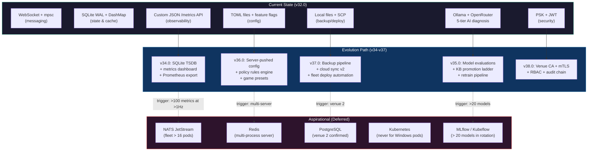
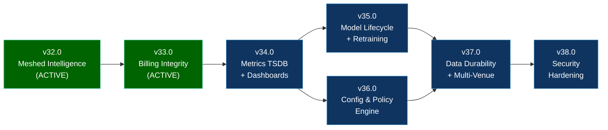
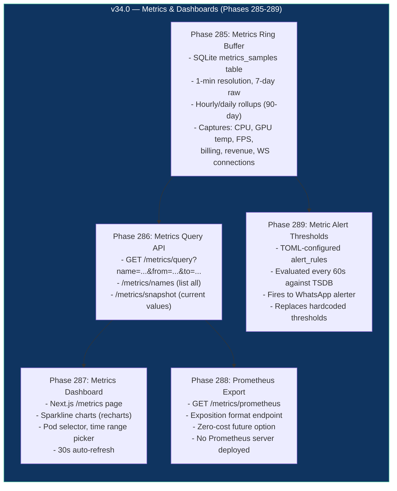
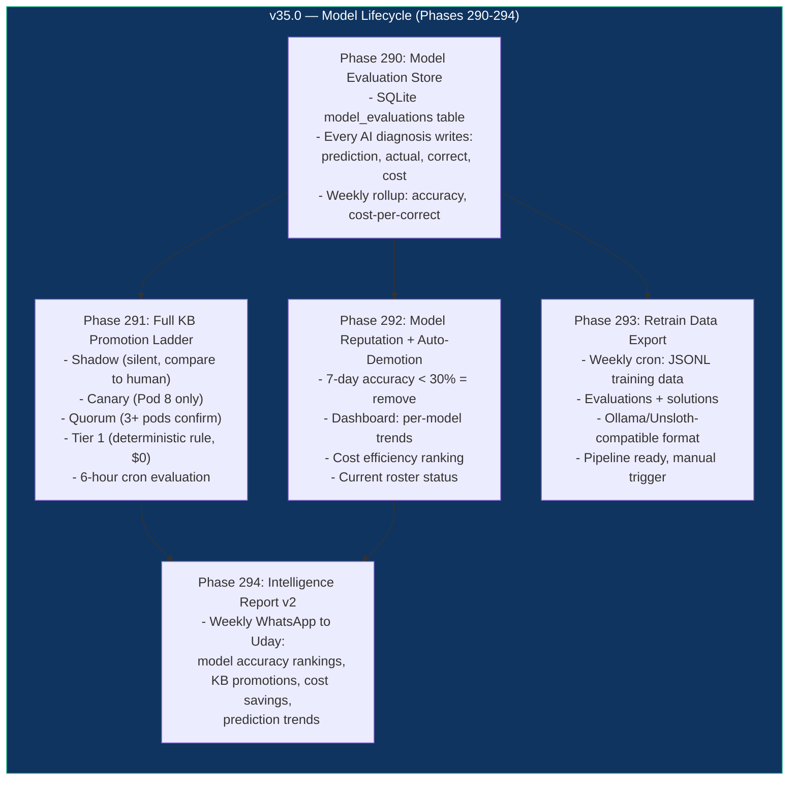
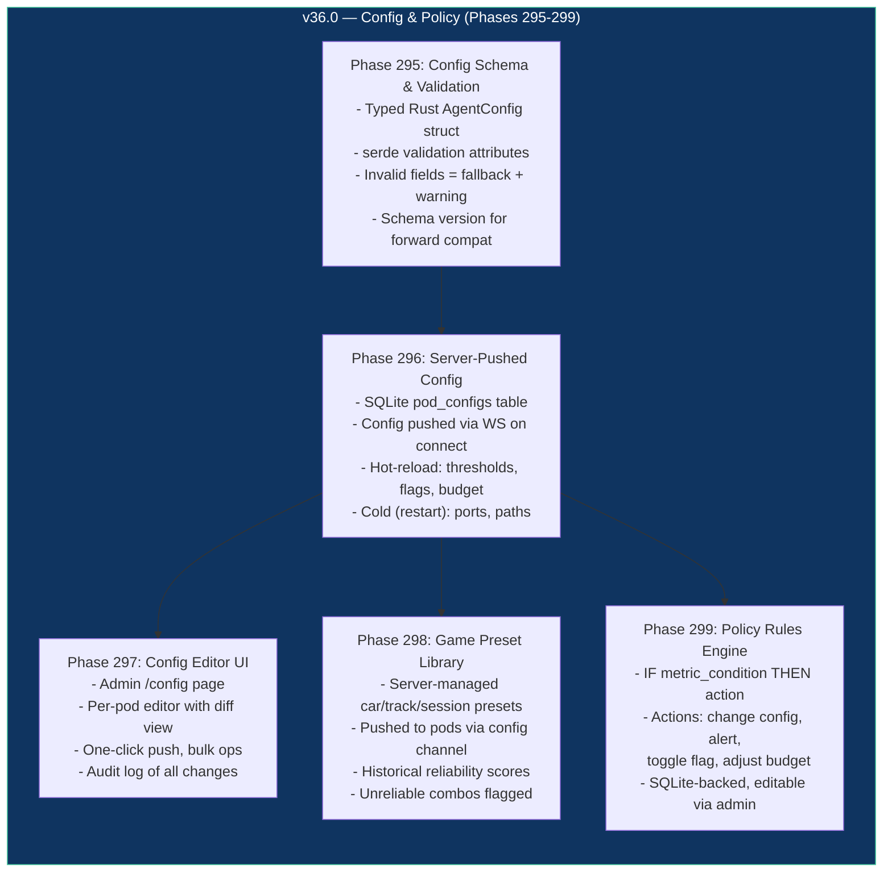
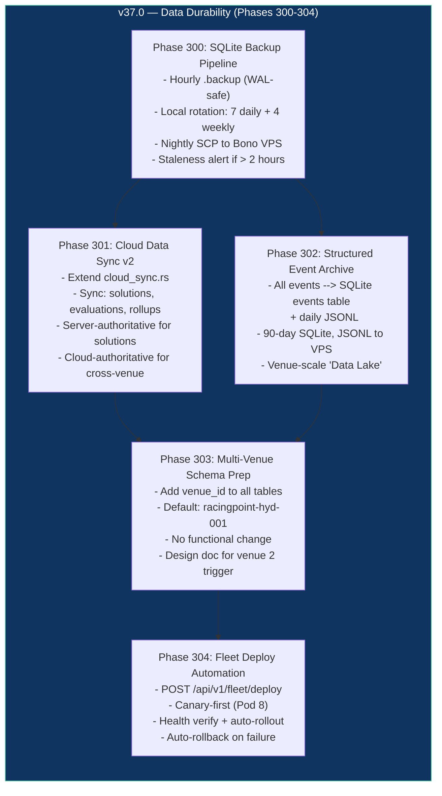
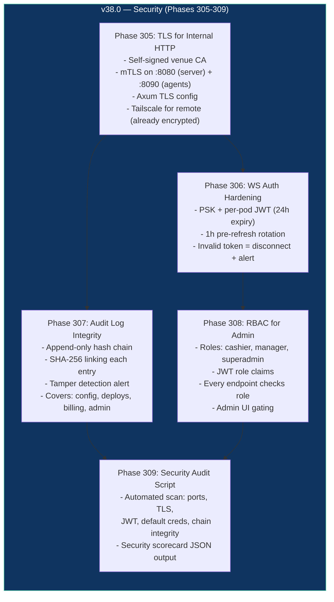

# Infrastructure Evolution Roadmap: v34.0 - v37.0

> Created: 2026-04-01 | Source: Aspirational architecture audit + venue-scale design session
> Status: BACKLOG — not initialized as GSD milestones yet
> Depends on: v32.0 (Meshed Intelligence) + v33.0 (Billing Integrity) shipping first

## Origin

This roadmap was designed by analyzing an aspirational architecture document that described
enterprise-grade infrastructure (NATS, Redis, Prometheus, MLflow, Kubeflow, Kubernetes, etcd,
MinIO/S3, Data Lake) and mapping each component to a **venue-scale alternative** that delivers
~80% of the benefit at ~10% of the complexity.

**Standing rule applied:** "Extend, don't replace" — WS + mpsc + SQLite + DashMap sufficient
for 8 pods. External dependencies only when current solutions hit scaling limits.

---

## System Context Flowchart

---

## Dependency Graph

**Parallelism:** v35.0 and v36.0 can partially overlap (independent domains).
v37.0 needs all data stores from v34-v36 to exist before backing them up.
v38.0 is last — hardens the final attack surface.

---

## v34.0 — Time-Series Metrics & Operational Dashboards

**Theme:** Give the custom metrics infrastructure time-series depth so you can answer
"what happened last Tuesday at 8pm" without grepping JSONL logs.

**Why now:** v32.0 builds autonomous action loops. v34.0 makes those loops observable
and queryable. You cannot tune predictions, pricing, or scheduling without historical
trend data.

**Aspirational components replaced:**
- Prometheus TSDB --> SQLite metrics_tsdb + rollups
- Grafana --> Custom Next.js /metrics page
- Alert Router --> WhatsApp threshold alerts

### Key Files
| Phase | New/Modified File | Purpose |
|-------|------------------|---------|
| 285 | `crates/racecontrol/src/metrics_tsdb.rs` (new) | SQLite time-series store with rollups |
| 286 | `crates/racecontrol/src/api/metrics_query.rs` (new) | Query + snapshot + names endpoints |
| 287 | `racingpoint-admin/src/app/metrics/page.tsx` (new) | Sparkline dashboard page |
| 288 | `crates/racecontrol/src/api/metrics_query.rs` (extend) | Prometheus exposition format |
| 289 | `crates/racecontrol/src/alert_engine.rs` (extend) | TOML-driven threshold alerts |

---

## v35.0 — Structured Retraining & Model Lifecycle

**Theme:** Close the continuous learning loop. Solutions that work get promoted;
models that underperform get demoted; the system gets measurably smarter each week.

**Why now:** v32.0 builds the KB hardening pipeline (observation stage). v34.0 gives
you metrics to measure model accuracy. v35.0 wires them together.

**Aspirational components replaced:**
- MLflow --> SQLite model_evaluations table
- Kubeflow --> Cron + JSONL export
- Feature Store --> fleet_solutions + model_evaluations

### Key Files
| Phase | New/Modified File | Purpose |
|-------|------------------|---------|
| 290 | `crates/racecontrol/src/fleet_kb.rs` (extend) | Evaluation tables + write functions |
| 291 | `crates/racecontrol/src/fleet_kb.rs` (extend) | Promotion pipeline with cron trigger |
| 292 | `crates/racecontrol/src/ai.rs` + admin page (new) | Model roster management + dashboard |
| 293 | `scripts/export-training-data.sh` (new) | Weekly JSONL export |
| 294 | `crates/racecontrol/src/fleet_report.rs` (extend) | Enhanced weekly report |

---

## v36.0 — Config Management & Policy Engine

**Theme:** Centralize configuration so every pod runs from server-pushed config,
not local TOML files that drift.

**Why now:** With metrics (v34) and model lifecycle (v35) working, the next
bottleneck is config drift across 8 pods.

**Aspirational components replaced:**
- etcd Policy Store --> SQLite + WS config push
- Config Management --> Typed schema + admin UI

### Key Files
| Phase | New/Modified File | Purpose |
|-------|------------------|---------|
| 295 | `crates/rc-common/src/config_schema.rs` (new) | Typed config with validation |
| 296 | `crates/racecontrol/src/config_push.rs` (extend) | WS-based config distribution |
| 297 | `racingpoint-admin/src/app/config/page.tsx` (new) | Config editor UI |
| 298 | `crates/racecontrol/src/catalog.rs` (extend) | Game preset management |
| 299 | `crates/racecontrol/src/policy_engine.rs` (new) | Lightweight rule engine |

---

## v37.0 — Data Durability & Multi-Venue Readiness

**Theme:** Ensure operational data survives hardware failure and prepare the data
layer for a potential second venue.

**Why now:** With metrics, model lifecycle, and config centralized, the biggest
risk is data loss. SQLite on a single server disk is a single point of failure.

**Aspirational components replaced:**
- MinIO/S3 --> Local backup + SCP to Bono VPS
- Data Lake --> JSONL archives + SQLite events table
- GitOps Deploy --> Automated binary rollout with canary

### Key Files
| Phase | New/Modified File | Purpose |
|-------|------------------|---------|
| 300 | `scripts/backup-databases.sh` (new) | Automated backup + rotation |
| 301 | `crates/racecontrol/src/cloud_sync.rs` (extend) | Multi-table cloud sync |
| 302 | `crates/racecontrol/src/activity_log.rs` (extend) | Structured event schema |
| 303 | DB migration + `docs/MULTI-VENUE-ARCHITECTURE.md` | Schema + design doc |
| 304 | `crates/racecontrol/src/ota_pipeline.rs` (extend) | Canary deploy with rollback |

---

## v38.0 — Security Hardening & Operational Maturity

**Theme:** Harden the security posture after all data flows are established.

**Why now:** With data flowing through metrics, config, and cloud sync channels,
the attack surface has grown. This is the right time to harden.

**Aspirational components replaced:**
- mTLS --> Self-signed venue CA + mutual TLS
- IAM --> SQLite-backed RBAC
- Audit --> Hash-chained append-only logs

### Key Files
| Phase | New/Modified File | Purpose |
|-------|------------------|---------|
| 305 | `crates/racecontrol/src/tls.rs` (extend) + `scripts/generate-venue-ca.sh` | Venue CA + mTLS |
| 306 | `crates/racecontrol/src/ws/` + `crates/rc-agent/src/` | JWT rotation on WS |
| 307 | `crates/racecontrol/src/activity_log.rs` (extend) | Hash-chained audit |
| 308 | `crates/racecontrol/src/auth/` + admin UI | Role-based access |
| 309 | `scripts/security-audit.sh` (new) | Automated security scan |

---

## Aspirational --> Venue-Scale Mapping (Complete)

| Aspirational Component | Venue-Scale Replacement | Milestone | Upgrade Trigger |
|---|---|---|---|
| Prometheus TSDB | SQLite metrics_tsdb | v34.0 | >100 metrics at >1Hz |
| Grafana | Custom Next.js | v34.0 | Never (custom is better) |
| MLflow | SQLite model_evaluations | v35.0 | >20 models |
| Kubeflow | Cron + JSONL export | v35.0 | Ollama supports fine-tuning |
| etcd | SQLite + WS config push | v36.0 | Multi-server racecontrol |
| PostgreSQL | SQLite WAL | v37.0 prep | Venue 2 confirmed |
| MinIO/S3 | Local backup + SCP | v37.0 | Artifacts > 50GB |
| NATS | WS + mpsc | Deferred | Fleet > 16 pods |
| Redis | DashMap | Deferred | Multi-process server |
| Kubernetes | Bare metal + watchdog | Deferred | Never (Windows pods) |
| mTLS | Self-signed venue CA | v38.0 | -- |
| Slack/SMTP | WhatsApp Evolution API | Not needed | Uday uses WhatsApp |

---

## Estimated Coverage

~80% of aspirational architecture benefits at ~10% complexity and ~5% infrastructure cost.

## When to Initialize

Each milestone should be initialized with `/gsd:new-milestone` only when the preceding
milestone ships. Requirements may shift — don't lock in details too early.
Phase numbers are provisional and will be assigned at initialization time.
