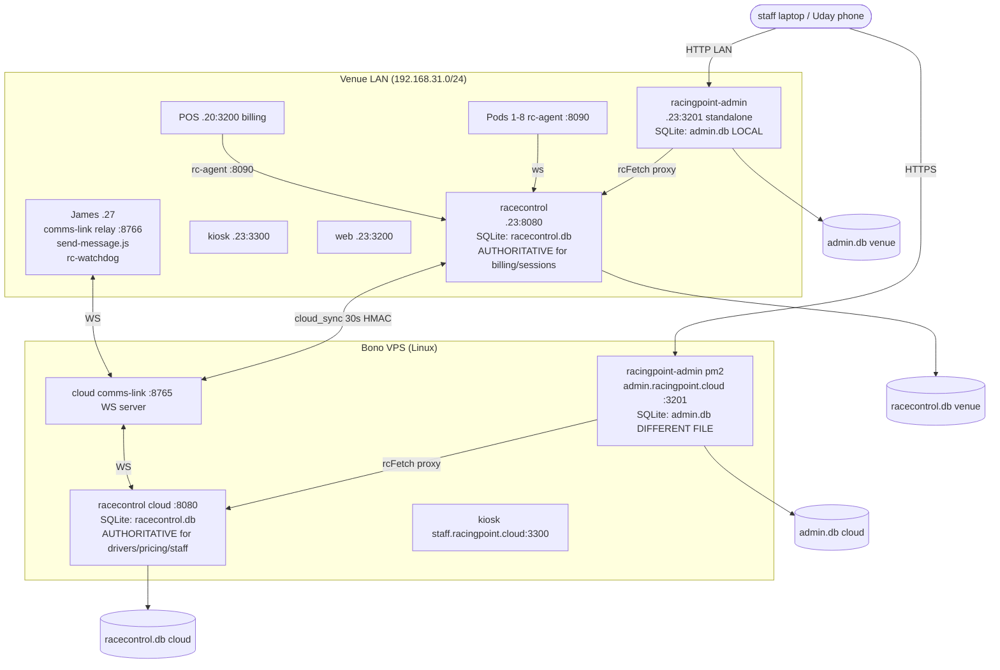
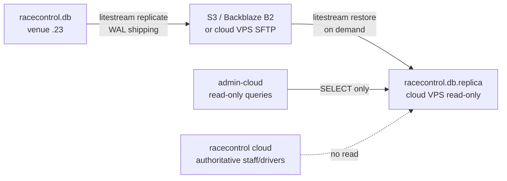
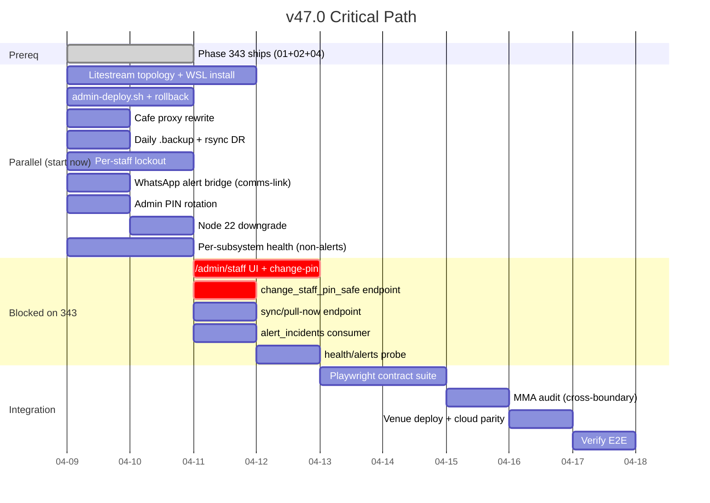

# v47.0 Architecture Research — Admin Dashboard Venue-Ready Hardening

**Date:** 2026-04-09
**Scope:** ARCHITECTURE dimension (topology, integration points, build order, rollback)
**Phase 343 dependency:** Plans 01 (409 guard) + 02 (post-write verify + `alert_incidents`) must ship first. Plan 03 is SUPERSEDED and its design is inherited here.

---

## System Topology Diagram



**Two data realities today:**
- `racecontrol.db` is replicated via application-level `cloud_sync.rs` (HMAC-signed, 30s interval, SYNC_TABLES whitelist, HTTP fallback). Venue is authoritative for billing/laps/sessions; cloud is authoritative for drivers/pricing/staff_members/kiosk_experiences.
- `admin.db` is **NOT replicated at all**. Venue and cloud hold different files, different rows, different IDs. Cafe menu written via admin has never been visible on kiosk POS because POS reads `racecontrol.db.cafe_items`.

---

## Replication Topology (Litestream details)

### Target: Option A — Venue-push read-replica to cloud



**Key facts:**

1. **Direction:** Venue pushes WAL segments to an object store. Cloud pulls (restore mode) into a replica. This keeps venue as source-of-truth for sessions/billing/laps while letting cloud admin render venue-state dashboards (current sessions, live pod utilization, laps today) without a round-trip over the WAN sync loop.

2. **Why not replace cloud_sync.rs:** cloud_sync.rs is bidirectional and carries cloud-authoritative tables (drivers, pricing, staff_members) venue→cloud is a NON-GOAL for those. Litestream is strictly for venue→cloud READ access to venue-only tables (sessions, billing_events, laps). The two coexist.

3. **Windows support:** Litestream has **no official Windows binary**. Options:
   - **Recommended:** run Litestream in **WSL2** on server .23 with the `.db` path bind-mounted from Windows (`/mnt/c/RacingPoint/racecontrol.db`). SQLite WAL files can be read across the WSL boundary — but WAL segments must not be touched by Windows while WSL holds them. Litestream opens the DB in shared mode, so this is safe if racecontrol keeps using `journal_mode=WAL`.
   - **Fallback:** run Litestream in a Linux container via Docker Desktop (same bind-mount story).
   - **Not viable:** native Windows build — community ports exist but are unmaintained.

4. **Replication lag detection:** Litestream exposes `/metrics` Prometheus endpoint. Cloud admin detects lag via a new probe: `GET /api/health/replication` which reads a sentinel row (`SELECT max(updated_at) FROM replication_heartbeat WHERE id=1`) from the replica and compares to `now() - threshold`. Venue writes to `replication_heartbeat` every 10s via a background tokio task added to racecontrol. Lag > 60s → degraded; > 300s → alert.

5. **Failover on WAN drop:** venue keeps operating from local `racecontrol.db` — admin.racingpoint.cloud shows a banner "venue data stale (last update: N min ago)" but does NOT fail hard. Cloud-authoritative flows (staff PIN change) still work via direct cloud writes. When WAN returns, Litestream resumes WAL shipping from its last checkpoint (no full re-sync).

6. **Disaster recovery path:** if venue disk dies, `litestream restore -o racecontrol.db s3://bucket/racecontrol` recovers to last WAL segment. RPO = snapshot interval (default 10s for WAL, 1h for full snapshot). Combined with the daily `sqlite3 .backup` + rsync that v47.0 adds, DR has two independent paths.

---

## Data Flow Changes

### Current (broken)

```
Admin writes cafe item
  └─> POST /api/cafe/menu (Next.js)
        └─> getDb().prepare('INSERT INTO menu_items...')  [admin.db]
              └─> NEVER VISIBLE to kiosk/POS (they read racecontrol.db.cafe_items)

Admin staff PIN change
  └─> operator uses curl/sqlite3 directly on venue (no UI)
        └─> writes cloud → waits for sync → prays venue pulls
              └─> no verification, no audit, no rollback

Admin degraded detection
  └─> GET /api/health returns {status: "degraded", pages_missing: [...]}
        └─> nobody consumes it, nobody alerts
```

### Target v47.0

```
Admin writes cafe item
  └─> POST /api/cafe/menu (Next.js rewrite)
        └─> rcFetch → /api/v1/cafe/items  [racecontrol.db via rc]
              └─> Visible on kiosk, POS, admin (one source)
              └─> Litestream ships WAL → cloud admin sees it ~10s later

Admin staff PIN change
  └─> POST /api/admin/staff/[id]/change-pin (Next.js)
        └─> fetch cloud racecontrol /api/v1/admin/staff/{id}/change-pin
              └─> change_staff_pin_safe orchestrator
                    ├─> direct cloud DB write
                    ├─> post_write_verify_staff_pin (from 343-02)
                    ├─> trigger venue sync/pull-now (via relay command)
                    ├─> HTTP validate-pin round-trip to venue
                    └─> returns {cloud_verified, venue_verified, latency_ms}

Admin degraded detection
  └─> GET /api/health/* (per-subsystem probes)
        └─> background watcher evaluates every 30s
              └─> on state transition healthy→degraded:
                    └─> POST comms-link relay /alert/whatsapp
                          └─> James .27 sends via send-message.js + WhatsApp gateway
                                └─> dedup key: (service, subsystem, severity) with 10min window
```

---

## Integration Points

### New files (path + purpose)

**racecontrol backend (venue + cloud — ships as single binary):**
- `crates/racecontrol/src/api/admin_staff.rs` — new module for `change_staff_pin_safe` handler + cloud-only guard. Inherits design from 343-03 PLAN.
- `crates/racecontrol/src/api/sync_admin.rs` — `sync_pull_now` handler. Calls refactored `cloud_sync::pull_single_table(&state, table)`.
- `crates/racecontrol/src/replication_heartbeat.rs` — 10s tokio task writing `replication_heartbeat(id=1, updated_at=now())`. Runs venue-only (gated by `is_cloud=false`).
- `crates/racecontrol/src/alerts.rs` — `emit_alert(incident_kind, subsystem, message)` called by health watcher; writes to `alert_incidents` (table added in 343-02) and POSTs to comms-link relay. Dedup via `(kind, subsystem)` key with 10-min cooldown stored in-memory + mirrored to `alert_incidents.last_emitted_at`.
- `migrations/NNNN_replication_heartbeat.sql` — creates `replication_heartbeat` table.
- `migrations/NNNN_admin_lockout_per_staff.sql` — extends existing `admin_lockout` with `staff_id TEXT` column. Existing schema is keyed by `ip`; v47.0 adds per-staff-id tracking so one shared-IP venue staff tablet can't lock out all staff.

**racingpoint-admin (Next.js):**
- `src/app/admin/staff/page.tsx` — new page: staff list + Change PIN modal. (From 343-03 design.)
- `src/app/api/admin/staff/[id]/change-pin/route.ts` — proxy to cloud racecontrol.
- `src/app/api/health/db/route.ts` — SQLite reachability probe.
- `src/app/api/health/rc/route.ts` — racecontrol reachability (calls `${RC_URL}/api/v1/health`).
- `src/app/api/health/sync/route.ts` — cloud_sync lag from `/api/v1/sync/status`.
- `src/app/api/health/replication/route.ts` — Litestream replica freshness (cloud only).
- `src/app/api/health/alerts/route.ts` — read `alert_incidents` open count.
- `src/lib/health-aggregator.ts` — combines per-subsystem probes into one summary (used by dashboard widget).
- `src/lib/alert-client.ts` — POSTs to comms-link relay alert endpoint.

**Deploy + DR:**
- `scripts/admin-deploy.sh` — cross-platform (detects OS, routes to Windows or Linux paths). Handles: `npm ci`, `npm run build`, copy `.next/static` into `.next/standalone/`, preserve previous `admin-prev/` directory, health-probe post-swap, auto-rollback on probe failure.
- `scripts/litestream-install-wsl.sh` — one-time WSL Litestream install + systemd-style service under WSL2.
- `scripts/backup-daily.sh` — `sqlite3 racecontrol.db .backup backups/racecontrol-YYYYMMDD.db` + rsync to cloud VPS. Scheduled task (Windows) / cron (Linux).
- `litestream.yml` — replication config for venue (source) and cloud (restore target).
- `comms-link/alert-bridge.js` — new endpoint `POST /alert/whatsapp` on the relay that fans out to WhatsApp + email + LOGBOOK.

**Tests:**
- `racingpoint-admin/tests/contract/cafe-menu.spec.ts` — Playwright contract: admin cafe CRUD hits rc, NOT admin.db.
- `racingpoint-admin/tests/contract/staff-pin.spec.ts` — E2E change-PIN flow (extends 343-04).
- `racingpoint-admin/tests/contract/health-probes.spec.ts` — each probe returns expected shape.

### Modified files (path + change summary)

- `crates/racecontrol/src/cloud_sync.rs` — extract `pull_single_table(&AppState, &str) -> Result<usize>` from the main pull loop so `sync_pull_now` can call it.
- `crates/racecontrol/src/auth/admin.rs` — extend lockout from IP-only to `(ip, staff_id)` composite key. Add DB-persistence of per-staff counters.
- `crates/racecontrol/src/api/routes.rs` — register `admin/staff/{id}/change-pin`, `sync/pull-now`, `health/replication`, `admin/cafe/items` (if new admin-gated endpoints are needed over and above the existing `/cafe/items`).
- `crates/racecontrol/src/cafe.rs` — no changes expected (already has full CRUD). Admin just starts calling it.
- `crates/racecontrol/src/main.rs` — spawn `replication_heartbeat::spawn_task(state)` on venue instances.
- `racingpoint-admin/src/app/api/cafe/menu/route.ts` — **REWRITE**: delete the `getDb()` path, replace with `rcFetch('cafe/items', ...)`. This kills the `admin.db.menu_items` write path entirely. Keep the table in `admin.db` as a read-only migration artifact but stop writing to it.
- `racingpoint-admin/src/lib/db.ts` — mark `menu_items` as DEPRECATED in a code comment. Remove the seed call (`seedMenu`). Leave other tables untouched (HR, purchases, sales are admin-native and still belong here — pending a future milestone to migrate them).
- `racingpoint-admin/src/app/api/health/route.ts` — refactor to call sub-probes and aggregate. Keeps backward compat (same 200/503 semantics).
- `racingpoint-admin/next.config.ts` — no change (already has correct `outputFileTracingRoot`).
- `racingpoint-admin/package.json` — pin Node engine to `>=22 <23` (enforce LTS). Venue .23 currently on Node 24 per memory — downgrade window.
- `comms-link/james/index.js` — add `/alert/whatsapp` route handler that calls `send-message.js` with deduplication.
- `docs/ARCHITECTURE.md` — add Section 23 "Admin Dashboard Two-Tier Topology" + Section 24 "Replication (Litestream)".

---

## Phase 343 Dependency Analysis

### Blocking (must wait for 343 ship)

- `/admin/staff` Change PIN UI (343-03 inherited design) — needs 343-01's 409 guard so venue rejects direct writes, and 343-02's post-write verify + `alert_incidents` table as the substrate.
- `change_staff_pin_safe` endpoint — the orchestrator reuses `post_write_verify_staff_pin()` from 343-02.
- Any code that writes to `alert_incidents` (the v47.0 alerts.rs) — table schema ships in 343-02.
- E2E staff PIN Playwright test extension (reuses 343-04's `staff-pin-lifecycle.spec.ts` harness).

### Non-blocking (can start immediately, parallel to 343)

- Litestream topology (new, zero code overlap with 343).
- `admin-deploy.sh` script (pure deploy infra).
- Cafe menu proxy rewrite (touches `cafe.rs` — already exists — and admin route; no 343 overlap).
- Per-subsystem `/api/health/*` probes in admin (except `/health/alerts` which needs the table).
- Daily `.backup` + rsync DR script.
- Per-staff-id lockout extension (`auth/admin.rs` — 343 doesn't touch this file).
- WhatsApp alert bridge in comms-link (comms-link repo is completely independent of 343).
- Admin PIN rotation (hardcoded 261121 → env var) — config only.
- Node 22 LTS downgrade on venue .23.

---

## Build Order (critical path)



**Critical path:** Phase 343 ship → 343-dependent backend (change_staff_pin_safe + sync/pull-now) → admin UI → Playwright → MMA → deploy → verify.

**Parallel tracks (8 items)** can land while 343 is in flight — the deploy script, Litestream, cafe proxy, and health probes are all independent.

---

## Rollback Strategy (per phase)

| Phase | Rollback approach |
|---|---|
| **Litestream install** | Stop `litestream replicate` service in WSL. Venue racecontrol unaffected (WAL file keeps being written as normal). Cloud replica goes stale but no hard failure — admin cloud shows banner. To fully revert, drop replica file. |
| **admin-deploy.sh** | Script preserves previous build in `admin-prev/`. On post-deploy health probe failure, auto-swap back: `mv admin admin-bad && mv admin-prev admin && restart`. Windows uses `StartAdminSvc` scheduled task restart; Linux uses `pm2 restart racingpoint-admin`. DB migrations: all admin.db migrations are `CREATE TABLE IF NOT EXISTS` + `ALTER TABLE ADD COLUMN` only — zero destructive migrations. New columns are additive → previous binary ignores them. |
| **Cafe proxy rewrite** | Feature-flag via env var `ADMIN_CAFE_USE_RC=true`. If rewrite regresses, flip to false → falls back to old admin.db path. `admin.db.menu_items` rows are not deleted, just stale-frozen. |
| **change_staff_pin_safe** | Endpoint is additive. If broken, `/admin/staff` page shows the button but the modal falls back to displaying "manual fallback: contact James" with the legacy curl command. No route removal needed — just stop advertising it in the UI. |
| **sync/pull-now** | Additive endpoint. If broken, normal 30s cloud_sync loop still runs — removing the button from the UI is the rollback. |
| **Per-staff lockout** | New column `staff_id` is nullable. If logic is wrong, revert the auth/admin.rs change; existing IP-based lockout still works because the column is optional. |
| **WhatsApp alert bridge** | Env var `ALERT_DESTINATION=none|whatsapp|log`. If bridge misfires, set to `log` (write to LOGBOOK only) or `none`. |
| **Health probes** | Probes are independent routes. Removing any one probe just removes its entry from the aggregator — UI shows "n/a" for that subsystem. |
| **Node 22 LTS downgrade** | Keep Node 24 installation alongside. `StartAdminSvc` task runs specific `node24\node.exe` path. Rollback = edit the .bat to point back at node24. |
| **Litestream replica on cloud** | Destructive rollback: delete replica file. Cloud racecontrol.db (authoritative for staff/drivers) is a DIFFERENT file — never touched. |

---

## Open Architectural Questions

1. **Cloud→venue HTTP reachability for `venue_validate_pin_http`.** Phase 343-03 flagged this unresolved. Options: (a) add direct cloud→venue URL via VPN (requires Tailscale always-up on server .23, currently fragile); (b) use comms-link relay as the transport (`POST /relay/exec/run` with a new `validate_pin` dynamic command); (c) piggyback on the existing cloud_sync WS channel by adding a request-response pattern. Recommendation: **option (b)** — relay is already the canonical venue-exec path, and `feedback_relay_dynamic_registry_trumps_static.md` warns that dynamic registry is how we do this today. Risk: dynamic registry was poisoned on 2026-04-09 — need a schema guard first (see `feedback_permanence_gate_data_file_fixes.md`).

2. **Litestream object store choice.** S3 ($) vs Backblaze B2 (cheaper) vs self-hosted SFTP on Bono VPS (free but single point of failure). Recommendation: B2 for cost + Bono VPS SFTP as redundant target (Litestream supports multiple replica destinations in one config).

3. **`admin.db` non-menu tables (HR, purchases, sales, employees, attendance).** These are admin-native and currently have zero cloud presence. v47.0 scope: migrate only `menu_items` (because it has a canonical home in racecontrol). Defer HR/purchases/sales migration to a future milestone (v48+). Explicitly document that `admin.db` on venue and cloud remain divergent for these tables.

4. **`RC_JWT_SECRET` rotation.** Admin middleware verifies JWTs with `RC_JWT_SECRET`. If we rotate, every admin tab with a live session breaks mid-flight. Need a dual-key verification window (accept both old + new for 12h) — this is NOT in Phase 343 and should be v47.0 scope or explicitly deferred.

5. **Health probe auth.** `/api/health` is in middleware `PUBLIC_PATHS`. Should sub-probes (`/api/health/db`, `/api/health/rc`) also be public? They leak internal state (DB reachability, sync lag). Recommendation: public for liveness fields only, redact internal error messages; full diagnostic variant at `/api/health/debug` under admin auth.

6. **Litestream on Windows native.** Community fork `benbjohnson/litestream#windows` exists but is not production-tested at Racing Point scale. If WSL introduces ops overhead (WSL crashes, bind-mount races), revisit native in a future phase.

7. **Per-subsystem probe frequency vs cost.** If admin dashboard polls `/api/health` every 5s and that fans out to 5 sub-probes, we hit racecontrol 60 times/min just for monitoring. Recommendation: server-side caching with 10s TTL per sub-probe, or SSE/WebSocket push from a single background watcher.

8. **Schema guard on dynamic command registry.** Before v47.0 uses relay dynamic commands for validate-pin, we must add schema validation on `POST /relay/registry/register` (per 2026-04-09 incident). This is a comms-link change that should probably ship as a small pre-v47.0 hotfix.

---

## Summary for downstream (EXECUTION planner)

- **24 files to create, 12 files to modify** across 4 repos (racecontrol, racingpoint-admin, comms-link, docs).
- **8 phases can start immediately** (parallel track). **5 phases blocked** on Phase 343 Plans 01+02.
- **Critical path:** 343 → change_staff_pin_safe + sync/pull-now → admin UI → Playwright → MMA → deploy → verify.
- **Biggest unknown:** cloud→venue reachability for `venue_validate_pin_http` — relay dynamic registry is the recommended transport but needs schema-guard hotfix first.
- **Biggest hidden risk:** Litestream on WSL (Windows native unsupported). Have a Docker Desktop fallback ready.
- **Rollback is clean for every phase** except Litestream replica (destructive delete; mitigated by fact that replica is read-only and cloud-authoritative DB is a separate file).
